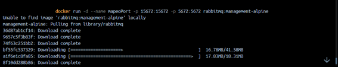

# Mi aprendizaje  

Al comparar mi conocimiento antes y después de completar esta tarea, pude notar que antes no entendía realmente el concepto de imagen y contenedor. Ahora sé que una imagen es una configuración que solo se puede leer y de la cual se pueden crear diferentes contenedores.

Además, con los comandos que aprendí, ahora puedo descargar imágenes especificando sus versiones, crear contenedores que se ejecuten en primer o segundo plano, darles nombres, mapear puertos de acceso y listar los contenedores que he creado.

En resumen, no tuve problemas al realizar la tarea, pero si tengo una recomendación, asegurarse de tener descargada la imagen de la que se quiere crear un contenedor. Esto hará que se evite recibir el siguiente mensaje "Unable to find image 'rabbitmq:management-alpine' locally" en la terminal. Aunque esto no es necesario dado que el sistema reconoce que no se encuentra la imagen y la descargará en ese momento. Esto  simplemente sirve para tener buenas prácticas y adquirir concienca de lo que se esta haciendo.

